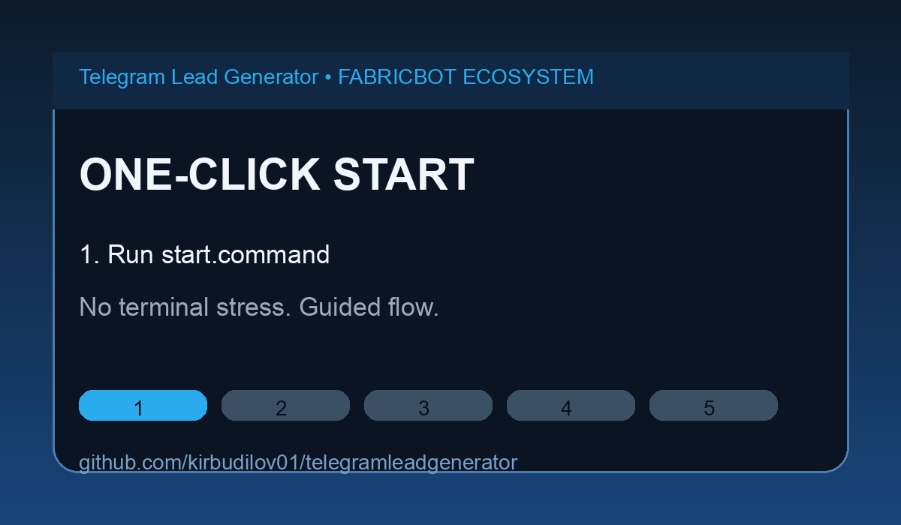

<div align="center">


<br/>

[](https://python.org)
[](https://postgresql.org)
[](https://my.telegram.org)
[](https://apple.com)
[](LICENSE)
[](https://github.com/kirbudilov01)
[](#-one-click-start-for-beginners)
[](#-ultra-noob-mode-absolute-beginner)

<br/>

**Parses your full Telegram history → PostgreSQL → Priority-ranked CSV reports on your Desktop**

[Quick Start](#-quick-start-one-command) · [Before You Begin](#-before-you-begin) · [How It Works](#%EF%B8%8F-how-it-works) · [CSV Format](#-csv-output-format)

<br/>

[](#-gif-demo)
[](#-one-click-start-for-beginners)

<br/>

> Part of the **[FABRICBOT ECOSYSTEM](https://github.com/kirbudilov01)** — open-source tools for sales automation & lead generation

<br/>


[](https://www.youtube.com/@fabricbotecosystem)
[](https://x.com/kirillfbc)
[](https://kirbudilov01.github.io/reposearchengine/)

</div>

---

## 🎬 GIF Demo

<div align="center">

</div>

---

## 🆚 Before / After

| Before | After |
|---|---|
| Thousands of chats, no priority, chaos | Top leads ranked by score and activity |
| Manual scrolling and guesswork | Structured CSV + multi-sheet XLSX bundle |
| No clear follow-up sequence | `top100_priority.csv` gives an immediate action queue |
| Data scattered in Telegram only | Local database + export files on Desktop |

---

## ✨ What It Does

| | |
|---|---|
| 📥 | Downloads **full message history** from all your personal chats (5000+ dialogs) |
| 🤖 | Automatically filters out **bots, channels, and spam** |
| 🔍 | Scans for **keywords**: AI, marketing, development, YouTube, pricing, etc. |
| 📊 | Assigns **priority scores 1–5** based on activity and conversation topics |
| 🖥️ | Saves **analysis CSVs + full raw history CSV + multi-sheet XLSX** to your Desktop |

---

## ⚡ Quick Start (one command)

> **Prerequisites:** macOS 12+, internet connection, Telegram account
> The installer will guide you through everything else — including where to get API keys.

```bash
git clone https://github.com/kirbudilov01/telegramleadgenerator.git && cd telegramleadgenerator && bash setup.sh
```

Then run the collector:

```bash
bash run.sh
```

That's it. CSV reports will appear on your Desktop automatically.

---

## 🟢 One-Click Start (for beginners)

After cloning the repository, you can run everything with one launcher:

```bash
chmod +x start.command && ./start.command
```

What this launcher does:
- Runs setup automatically if this is your first run
- Launches **Ultra Noob Mode** automatically
- Starts collection + analysis
- Saves result files to Desktop, including full raw history CSV
- Optionally opens local AI chat (Ollama)

---

## 🧠 Ultra Noob Mode (absolute beginner)

Use this if you want the safest, easiest path:

```bash
./start.command
```

What Ultra Noob Mode does automatically:
- Picks **Smart Filter** (personal chats only, no bots/channels)
- Picks **Full collection**
- Uses beginner-safe defaults with minimal questions
- Keeps all advanced options available in normal mode (`bash run.sh`)

---

## 📋 Before You Begin

Before running setup, you'll need **3 things** from Telegram:

### 1. Get your API credentials (free, takes 2 min)

1. Open **[my.telegram.org](https://my.telegram.org)** in your browser
2. Sign in with your Telegram phone number
3. Click **"API development tools"**
4. Create a new app — any name works (e.g. `MyApp`)
5. Copy **`App api_id`** and **`App api_hash`**

> The setup script will ask for these values interactively — no need to edit any files manually.

### 2. Your phone number

Format: `+19991234567` (country code + number, no spaces)

### 3. Access to your Telegram account

During setup, Telegram will send you a confirmation code.
Open your Telegram app and enter the code when prompted.

---

## 🚀 Step-by-Step Setup

```bash
# Step 1 — Clone the repo
git clone https://github.com/kirbudilov01/telegramleadgenerator.git
cd telegramleadgenerator

# Step 2 — Run the installer (installs everything automatically)
bash setup.sh
```

The installer will walk you through each step in the terminal:

```
[1/8] Homebrew          → installs if missing
[2/8] Python 3.11       → installs if missing
[3/8] PostgreSQL 18     → installs and starts
[4/8] Dependencies      → pip install -r requirements.txt
[5/8] Database          → creates telegram_export
[6/8] API_ID            → shows where to get it, asks in terminal
[7/8] API_HASH + Phone  → same
[8/8] Telegram auth     → sends code to your phone
```

```bash
# Step 3 — Collect and analyze
bash run.sh
```

The terminal will ask two questions:

```
Choose collection profile:
     1) Smart Filter (recommended)  personal only, no bots/channels
     2) Custom selection            choose groups/bots/channels yourself

Run mode?
  1) Full collection          (first time)
  2) New messages only        (already collected)

Custom mode then asks:
     - Include group chats? [y/N]
     - Include bot dialogs? [y/N]
     - Include channels? [y/N]
```

After completion, a folder `telegram_analysis_DATE/` appears on your Desktop.

---

## 📂 Output Files

| File | Contents |
|------|---------|
| `top100_priority.csv` | ⭐ Top 100 by importance — **start here** |
| `top100_by_activity.csv` | Top 100 by message count |
| `all_chats.csv` | All analyzed chats |
| `full_history_raw.csv` | Full raw CSV of the entire collected history |
| `telegram_leads_bundle.xlsx` | Single Excel file with separate sheets for leads + full history |

---

## 🤖 Optional Local AI Chat

After each run, you can open a local AI chat over your generated CSV results.

The script asks:

```
Launch local AI chat now? [y/N]

Choose AI provider:
     1) Ollama (local)
     2) OpenAI API
     3) Anthropic Claude API

If you pick OpenAI Cloud:
     1) GPT-5.3-Codex
     2) GPT-4o-mini
```

Requirements:
- Install Ollama: https://ollama.com
- Pull model once: `ollama pull llama3.1`
- For OpenAI: set `OPENAI_API_KEY`
- For Claude: set `ANTHROPIC_API_KEY`

Default models:
- Ollama: `llama3.1`
- OpenAI: `gpt-5.3-codex` (or `gpt-4o-mini`)
- Anthropic: `claude-3-5-sonnet-latest`

Then you can type prompts like:
- "Show the top 10 warm leads in fintech"
- "Which contacts discussed AI automation budgets?"
- "Who should I follow up with this week and why?"

---

## ⚙️ How It Works

```
Telegram API
     │
     ▼
Telethon (MTProto)
     │  fetches full history of all dialogs
     ▼
PostgreSQL
     │  stores chats + messages locally
     ▼
Analyzer
     │  filters spam / bots / channels
     │  keyword matching
     │  priority scoring
     ▼
CSV on Desktop
```

**Priority scoring algorithm:**
- `priority = 5` — 200+ messages + 3+ keywords matched → **hot lead**
- `priority = 3` — 50+ messages or 3+ keywords → **warm**
- `priority = 1` — everything else

---

## 📋 CSV Output Format

| Column | Description |
|--------|---------|
| `chat_name` | Username or chat title |
| `chat_type` | `personal` / `group` |
| `message_count` | Total messages in the dialog |
| `priority` | 5 = hot, 3 = warm, 1 = cold |
| `intent` | `interest` = discussed tasks/deals; `neutral` = casual chat |
| `matched_keywords` | Keywords found in conversation |
| `last_messages` | Last 5 messages (quick context preview) |

---

## 🔧 Advanced

**Collect groups too:**
```bash
python main.py load --groups
```

**Re-run analysis without re-collecting:**
```bash
python analyze.py
```

**Check database stats:**
```bash
python main.py stats
```

---

## 📦 Requirements

- **macOS 12+** (Apple Silicon & Intel)
- Telegram account
- API credentials from [my.telegram.org](https://my.telegram.org) *(free)*

---

## 🔒 Privacy & Security

- `.env` and `*.session` files are in `.gitignore` — **never committed to git**
- All data is stored **locally on your machine only**
- Nothing is sent to third-party servers

---

## ❓ Stuck? Fast Fixes

**Problem:** Setup asks for API keys and you don't know where to get them  
**Fix:** Open https://my.telegram.org → "API development tools" → create app → copy `api_id` and `api_hash`.

**Problem:** Nothing happens after one-click start  
**Fix:** Run `chmod +x start.command` once, then run `./start.command` again.

**Problem:** Telegram collection fails  
**Fix:** Wait 10 minutes (rate limit), then retry. If needed, re-auth with `python auth.py`.

**Problem:** AI chat does not respond  
**Fix:**
- Ollama: install from https://ollama.com and run `ollama pull llama3.1`
- OpenAI: set `OPENAI_API_KEY`
- Claude: set `ANTHROPIC_API_KEY`

**Problem:** I only want the easiest mode  
**Fix:** Use `./start.command` — it launches Ultra Noob Mode with recommended defaults.

---

## 🤝 Contributing

Pull requests are welcome. For major changes, open an issue first.

---

<div align="center">

**Built with ❤️ as part of the [FABRICBOT ECOSYSTEM](https://github.com/kirbudilov01)**

*Open-source tools for sales automation, lead generation & Telegram data analysis*


</div>
